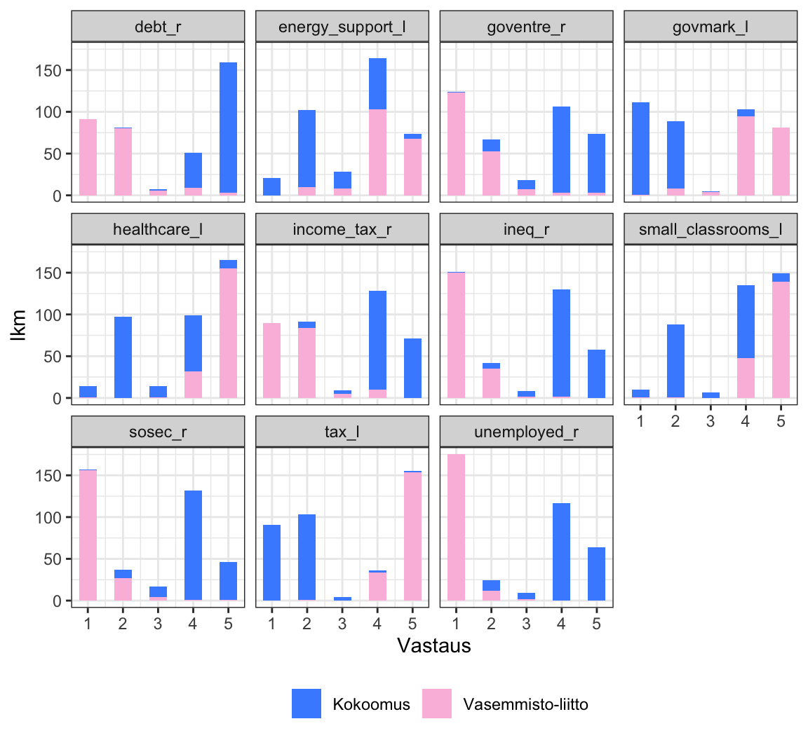
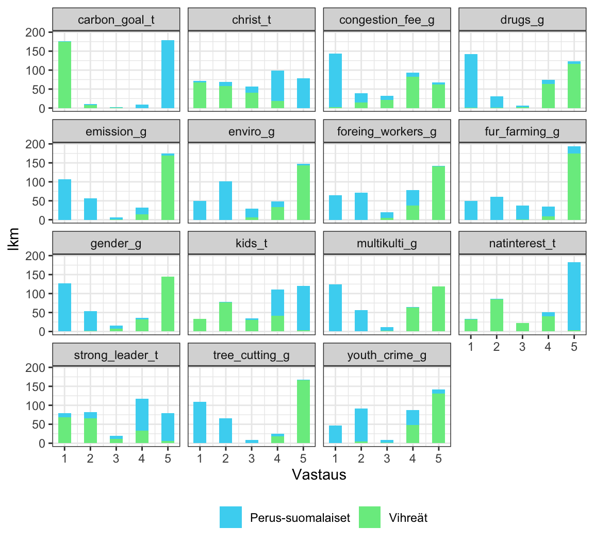
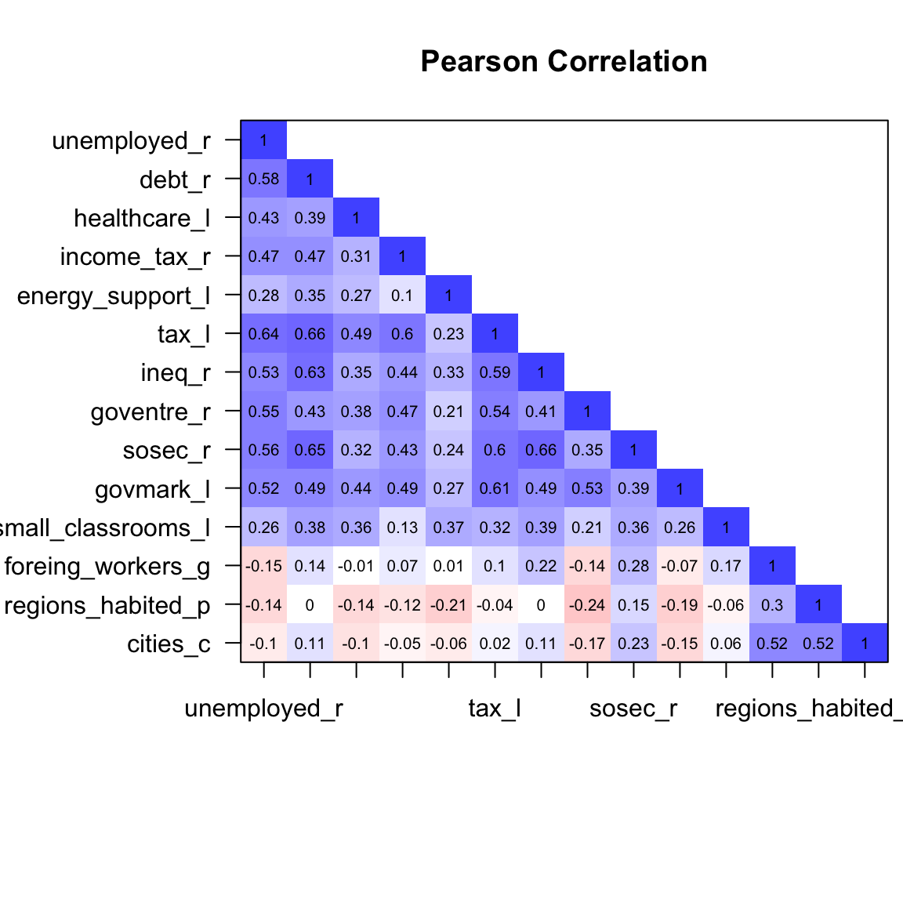
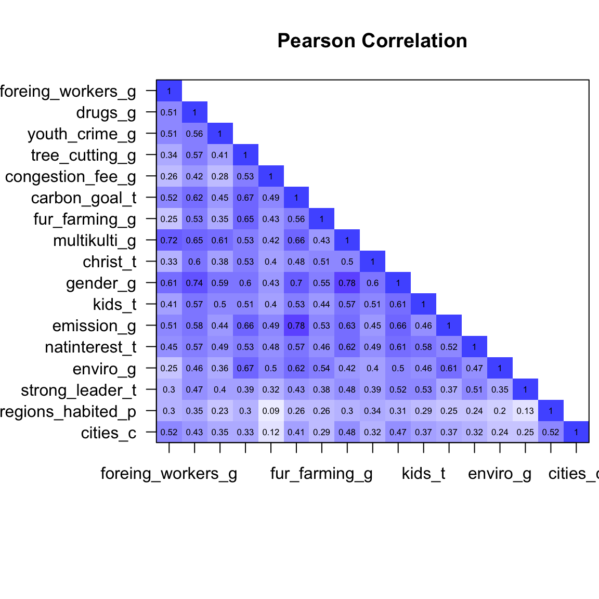
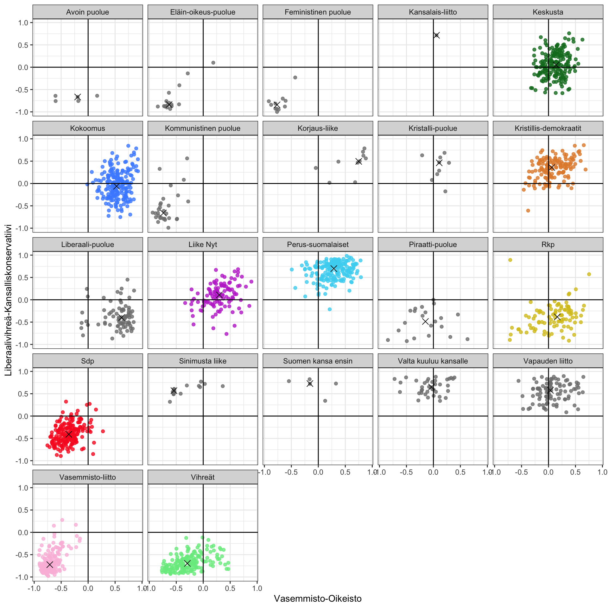

# Confirmatory Factorial Analysis

The HS Election machine of 2023 parliamentary elections implemented a new kind
of election machine algorithm using Confirmatory Factorial Analysis (read more
from [here](https://en.wikipedia.org/wiki/Confirmatory_factor_analysis) to
start).

This folder contains a description on how the analysis was made and the model
created, along with some analysis and example data. If you want to run explore
the data and follow the examples, you'll need R on your machine.
[R Studio](https://posit.co/download/rstudio-desktop/) recommended.

If you'd like to discuss the solution in more detail, reach out to us.

## First of all, why factorial analysis?

The traditional way to do election machines has been to use something like
[Manhattan distance](https://en.wikipedia.org/wiki/Taxicab_geometry) to measure
similarity with citizens and candidates. The strength of this method is its
simplicity - answer differently from a candidate, and your distance to them
grows. On the flip side, the simplicity also loses a lot of nuance - questions
in politics are almost never not dependant on other things (the underlying
assumption of a Manhattan distance is that things are of equal value and
not dependant on each other). Additionally, when the amount of questions
starts to increase (in Finland 30 is customary), the natural linear assumption
of distance between the candidate and the citizen becomes a little murky (what
does it mean to be, for example, 10 units away from something in a 30
dimensional space? See
[here](https://en.wikipedia.org/wiki/Curse_of_dimensionality) for notes about
high dimensional spaces).

We know from politics research that there are known dimensions or axises in
politics that candidates and parties fall into. The confirmatory factorial
analysis uses this information develop a statistical model which we can use
to reduce the dimensionality of the answer data by the candidates and citizens,
gaining a more nuanced insight into the values underlying the candidates' and
citizens' answers to the election machine. By reducing the dimensions we can
measure the distance between the candidates and citizens hopefully in a more
intuitive, two dimensional space.

## That was some technical nonsense, any other reasons?

Consider the election cycle of 2019-2023 in Finland. During that time a global
pandemic happened, land war returned to Europe and many other unforeseen things
happened. In this backdrop, which is more important?

- That you have agreed on specifics of some 30 questions with a candidate?
- That you share strong values with the candidate?

The user serving aim of using this method is to help them find candidates
that are as close as possible to their values in the hopes that those
candidates would then serve the citizens best.

## Running your own analysis

We've used the [lavaan package](https://cran.r-project.org/web/packages/lavaan/index.html)
as the main workhorse of our confrimatory factorial analysis.

In order to analyse our model, you'll need two things..

1. The file /data/example_data_20230220.csv, that contains actual anonymized
   candidate answers from the election machine.
2. A model for `lavaan`, such as this one below:

```r
# Create the lavaan model for confirmatory factor analysis. For lavaan model
# syntax, see https://lavaan.ugent.be/tutorial/syntax1.html
cfa_model <- "
  leftright =~ unemployed_r +  sosec_r + debt_r + tax_l + ineq_r + goventre_r + govmark_l + healthcare_l + income_tax_r
  green =~ enviro_g + emission_g + tree_cutting_g + congestion_fee_g + carbon_goal_t + fur_farming_g
  libcons =~ gender_g + christ_t + drugs_g + youth_crime_g
  nationalist =~ multikulti_g + natinterest_t + foreing_workers_g
  galtan  =~ strong_leader_t + libcons + nationalist + green

  periphery =~ a*regions_habited_p + a*cities_c
  leftright =~ foreing_workers_g

  sosec_r ~~ debt_r
  sosec_r ~~ ineq_r
  multikulti_g ~~ foreing_workers_g
  enviro_g ~~ tree_cutting_g
  emission_g ~~ carbon_goal_t
  debt_r ~~ ineq_r

  leftright ~~ 0*galtan
  galtan ~~ periphery
  leftright ~~ periphery
"
```

For convinience, this is the mapping part of our model creation script:

```r
# Start by reading in answers for analysis
candidate_df = data.table::fread("data/example_data_20230220.csv", encoding = "UTF-8") %>%
  data.frame() %>%
  select(2:31) %>%
  rename(
    ukraine_support_h = "Q1...Answer....hs.al.sk....Ukrainaa.on.tuettava.sodassa.ja.jälleenrakennuksessa.kustannuksista.huolimatta.",
    nato_spending_h = "Q2...Answer....hs....Suomen.on.käytettävä.puolustukseen.rahaa.vähintään.Naton.tavoitteen.verran.",
    small_classrooms_l = "Q3...Answer....hs....Peruskoulussa.pitää.rajoittaa.lailla.oppilaiden.määrää.yhtä.opettajaa.kohden..vaikka.se.tarkoittaisi.säästöjä.muualta..veronkorotuksia.tai.lisää.velkaa.",
    drugs_g = "Q4...Answer....hs.al.sk....Suomeen.on.perustettava.huumeiden.käyttöhuoneita.",
    healthcare_l = 'Q5...Answer....hs....Valtion.on.annettava.suunniteltua.enemmän.rahaa.sosiaali..ja.terveydenhuoltoon..vaikka.se.tarkoittaisi.säästöjä.muualta..veronkorotuksia.tai.lisää.velkaa.',
    youth_crime_g = 'Q6...Answer....hs.al.sk....Nuorisorikollisuutta.on.pyrittävä.kitkemään.ensisijaisesti.muilla.keinoilla.kuin.rangaistuksia.koventamalla.',
    unemployed_r = 'Q7...Answer....hs.al.sk....Työttömiä.pitää.saada.nykyistä.enemmän.töihin.heikentämällä.ansiosidonnaista.työttömyysturvaa.',
    foreing_workers_g = 'Q8...Answer....hs.al.sk....Suomeen.on.houkuteltava.aktiivisemmin.ulkomaisia.työntekijöitä.',
    debt_r = 'Q9...Answer....hs.al.sk....Valtion.velkaantumista.tulee.hillitä..vaikka.se.merkitsisi.leikkauksia.etuuksiin.tai.palveluihin.',
    income_tax_r = 'Q10...Answer....hs....Palkkojen.verotusta.pitää.alentaa..vaikka.se.johtaisi.palveluiden.leikkauksiin..muun.verotuksen.kiristämiseen.tai.velan.kasvuun.',
    energy_support_l = 'Q11...Answer....hs....Valtion.pitää.tukea.enemmän.kansalaisia..jotka.kärsivät.energian.hinnan.noususta..vaikka.se.kiihdyttäisi.inflaatiota.tai.heikentäisi.valtion.taloutta.',
    tree_cutting_g = 'Q12...Answer....hs.al.sk....Hakkuita.pitää.vähentää.valtion.metsissä.luontokadon.ja.ilmastonmuutoksen.torjumiseksi.',
    carbon_goal_t = 'Q13...Answer....hs.al.sk....Suomen.on.lykättävä.hiilineutraaliustavoitettaan.kauemmaksi.vuodesta.2035.',
    congestion_fee_g = 'Q14...Answer....hs....Helsingissä.ja.muissa.suurissa.kaupungeissa.on.otettava.käyttöön.ruuhkamaksu.',
    fur_farming_g = 'Q15...Answer....hs.al.sk....Turkistarhaus.on.kiellettävä.Suomessa.',
    tax_l = 'Q16...Answer....hs.al.sk....Jos.on.pakko.valita..on.parempi.korottaa.veroja.kuin.leikata.julkisia.palveluita.ja.sosiaalietuuksia',
    ineq_r = 'Q17...Answer....hs.al.sk....Suuret.tuloerot.ovat.hyväksyttäviä..jotta.erot.ihmisten.lahjakkuudessa.ja.ahkeruudessa.voidaan.palkita.',
    govmark_l = 'Q18...Answer....hs....Valtion.pitäisi.puuttua.nykyistä.voimakkaammin.markkinoiden.toimintaan..jotta.talous.olisi.kaikille.reilu..',
    sosec_r = 'Q19...Answer....hs.al.sk....Suomessa.on.liian.helppo.elää.sosiaaliturvan.varassa.',
    goventre_r = 'Q20...Answer....hs.al.sk....Valtion.ja.kuntien.omistusta.yritystoiminnassa.tulisi.vähentää.',
    multikulti_g = 'Q21...Answer....hs.al.sk....Suomen.muuttuminen.aiempaa.monikulttuurisemmaksi.ja.monimuotoisemmaksi.on.hyvä.asia.',
    christ_t = 'Q22...Answer....hs.al.sk....Kristilliset.arvot.ovat.hyvä.pohja.poliittiselle.päätöksenteolle.',
    gender_g = 'Q23...Answer....hs....Sukupuolen.moninaisuus.pitäisi.ottaa.huomioon.Suomessa.nykyistä.paremmin.',
    kids_t = 'Q24...Answer....hs.al.sk....Selkeitä.rajoja.ja.kuria.tarvitaan.nykyistä.enemmän.lasten.kasvattamisessa.',
    emission_g = 'Q25...Answer....hs.al.sk....Suomen.pitäisi.vähentää.omia.päästöjään.riippumatta.siitä..mitä.muut.maat.tekevät.',
    natinterest_t = 'Q26...Answer....hs.al.sk....Poliitikkojen.on.asetettava.Suomen.ja.suomalaisten.etu.kaiken.muun.edelle.',
    enviro_g = 'Q27...Answer....hs.al.sk....Ympäristön.etu.tulisi.asettaa.talouskasvun.ja.työpaikkojen.luomisen.edelle..jos.ne.ovat.keskenään.ristiriidassa.',
    strong_leader_t = 'Q28...Answer....hs....Maamme.kaipaa.vahvoja.johtajia..jotka.pystyvät.tekemään.vaikeitakin.päätöksiä.välittämättä.liikaa.muiden.mielipiteistä.',
    regions_habited_p = 'Q29...Answer....hs....Koko.Suomi.tulee.pitää.asutettuna..vaikka.siitä.koituisi.kustannuksia.',
    cities_c = 'Q30...Answer....hs.al.sk....Suomen.kaupungistuminen.on.hyvä.asia.'
  )
```

You'll also probably want to encode the questions to be pointing to the same
direction - the postix of the names is where the question initially points to

```
_l --> Left on the left-right axis
_r --> Right on the left-right axis
_g --> GAL on GAL-TAN
_t --> TAN on GAL_TAN
_p --> Periphery on periphery-vity
_c --> City on periphery-city
```

Once you have your questions encoded the way you want, you can create the
model using `lavaan` for example like this:

```r
# Create the model based on the candidate answers and the model above.
# In this example the candidate data frame is encoded in a way that the
# questions point to the same direction
cfa_fit <- cfa(model = cfa_model, data = candidates_df_ready, orthogonal = TRUE, missing = "ML")
```

Once you have your model in hand, you can project points onto the value
axises, for example like this (using the provided extreme responses as an
example here):

```r
# For visualisations and match percentage calculations we need to know the edges
# of our space, compute them using predetemined max values in accordance to the
# model.
extreme_responses_df <- data.table::fread("data/extreme_responses.csv", encoding = "UTF-8") %>%
  data.frame() %>%
  select(2:31) %>%
  as_tibble() %>%
  mutate(across(where(is.character), ~ na_if(., "")))

extreme_responses_ready <- reverseEncodeDataFrame(extreme_responses_df)

extreme_points <- lavPredict(fit, type = "lv", newdata = extreme_responses_ready, method = "regression",
                              se = "standard", label = TRUE, fsm = FALSE, level = 1,
                              optim.method = "bfgs", ETA = NULL)
```

The factor points produced by this method are the ones used in the TypeScript
side for the eventual matching calculations.

## How do the dimensions look like and how do parties and people fit there?

Before we jump to the final results, let's check out some preliminary results.

If you run your own analyses on the data, you can use these as benchmarks.

A way to highlight how things work with the confirmatory factorial
analysis here is to look at the questions used to distunguish between the
questions used to put the candidates on these axises.

Below are the answer distributions of

1. Vasemmistoliitto and Kokoomus, traditionally left and right accordingly,
   in the political spectrum, on the questions relating to the Left-Right axis

2. Vihreät and Perussuomalaiset, former being GAL and latter being TAN





The confirmatory factorial analysis model builds on these differences derived
from the data. The images above highlight how different parties fall into
different ends of the chosen axises.

The other important thing (regarding planning the questions too) are
correlations in the data. Correlations between the questions are shown in the images below (first image correlations on the questions about
Left-Right axis, second one GAL-TAN):





The correlations above have guided the creation of the model desribed earlier.
The claims with strong correlations form the basis for the axises (for example,
the energy support question was dropped from the Left-Right axis due to low
overall correlations).

In the image below the example data from the repo is projected to the value
space (axises Left-Right and GAL-TAN) using the model shown above, x marks the
median of the party:



This seems to match the generally held conception on where parties in Finland
land on these axises.
